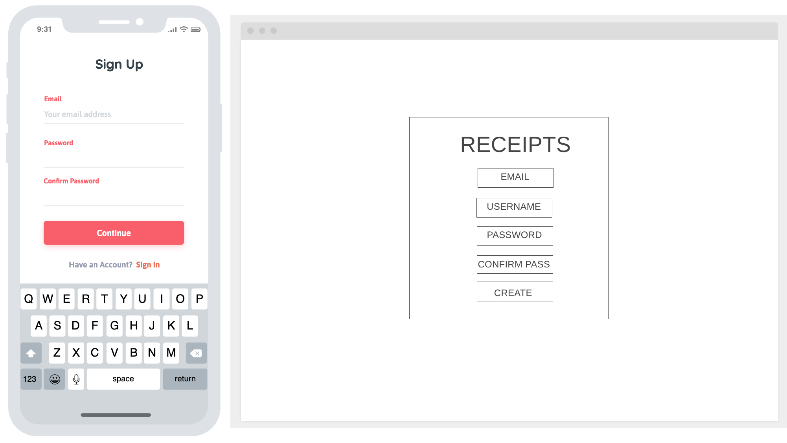
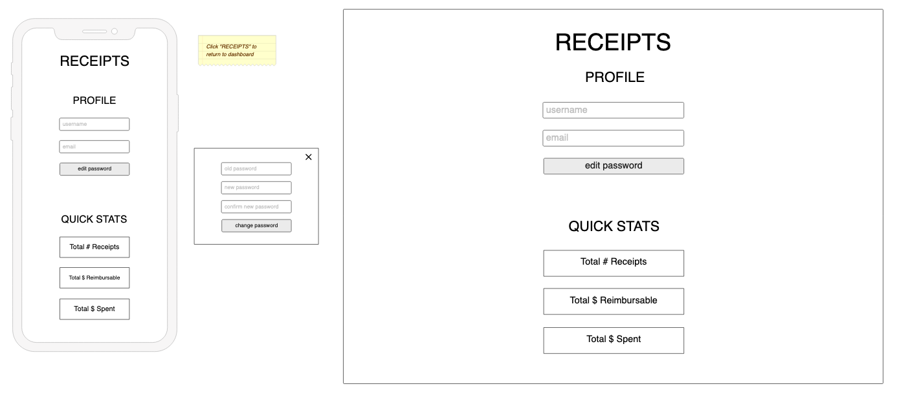

# Receipt Collection

###### Trello board for tracking

Trello Board Link: https://trello.com/b/ZZNFule6/receiptapp

## Overview

This app will be a place for the user to store all of their receipts. It will be a tool to help the user keep a clear record of purchases for future use. The user will be able to upload an image of their receipt and input the date, location of purchase, and amount of the transaction. The records will be accessible via an easy to use database.

---

## Install Steps

You will need the pip package to complete install steps. Once you have pip, the steps are as follows:

- Clone the repo: `git clone https://github.com/rheal3/receipt_app`
- Change directory into the repo: `cd receipt_app`
- Make sure venv is installed: `pip install venv`
- Create the virtual environment: `python3 -m venv venv`
- Activate the virtual environment: `source venv/bin/activate`
- Install the dependencies from requirments.txt: `pip3 install -r requirements.txt`
- Run the app: `python src/main.py`

---

## Wireframes

#### Landing page

The landing page will be the first page the user sees when not logged in. It will be attractive and simple.

#### Login and signup

Once the user clicks the button they will be sent to the login page which will have an option to sign up.

#### Dashboard page

This page is the main page of the app. Its features are:

- Shows a list of receipts.
- Allows the user to view and edit individual receipts.
- Has an add receipt button.
- Profile button linking to the Edit Profile page.
- Logout button.

#### Edit Receipt

The edit receipt feature will show above the main dashboard page which will appear opaque. The edit fields include: receipt image, date, merchant, amount, comment, and the reimbursable checkbox.

#### View Receipt

The view receipt feature will show above the main dashboard page which will appear opaque. It will have an exit button in the top right to leave the feature.

#### User profile page

On this page the user will be able to change their details, including: username, password, and email.

- Button to edit password. Box comes ontop of screen to enter new password.
- Place to enter new username and email.
- Click "RECEIPTS" to return to dashboard.

---
